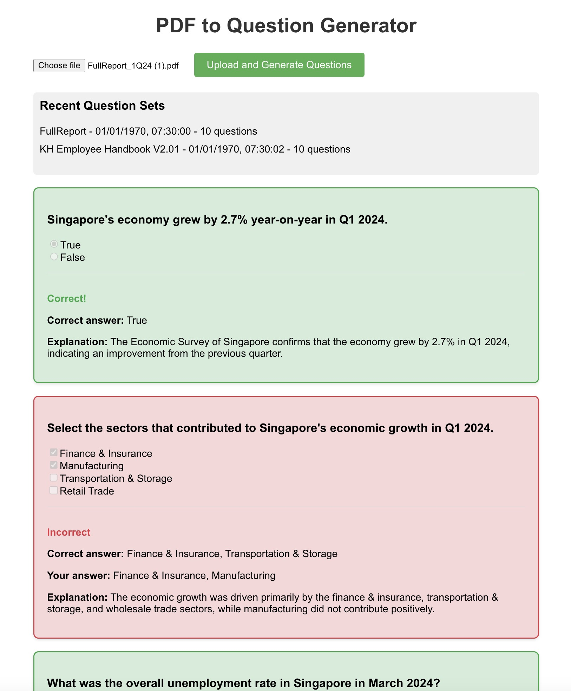

# PDF to Question Generator

This project is a web application that allows users to upload PDF documents and automatically generate questions based on the content. It uses React for the frontend and Node.js with Express for the backend.



## Features

- Upload PDF documents
- Generate multiple types of questions (multiple-choice, true/false, checklist, text response)
- View generated questions
- Submit answers and receive feedback
- View history of previous question sets

## Setup

Create a `.env` file in the root directory and add your OpenAI API key:

```
OPENAI_API_KEY=your_api_key_here
```

Run it:

```
npm install
npm run server
cd question-generator
npm install
npm start
```

